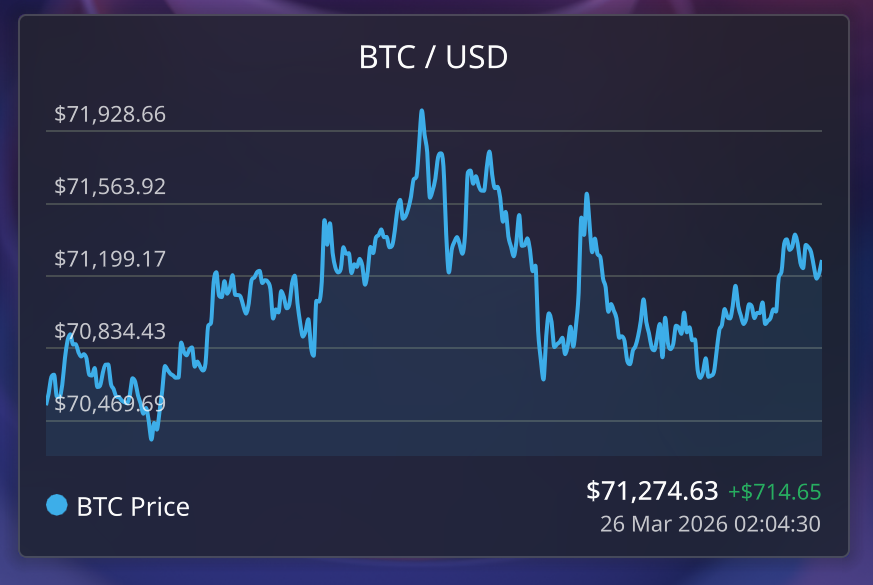
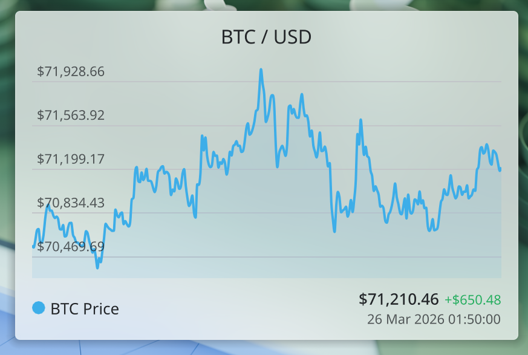

# BTC Price Plasmoid

A KDE Plasma 6.6 widget that displays the Bitcoin price as a smooth line chart with 24 hours of history. Built with Qt 6 and QML, it fetches live price data from the Coinbase public API.

| Dark theme | Light theme |
|:---:|:---:|
|  |  |

## Features

- Smooth monotone cubic interpolated line chart with fill
- 24h price change indicator (green/red)
- Theme-aware colors (works with light and dark Plasma themes)
- API error indicator with automatic recovery
- Automatic history reload after extended outages

## Getting started

1. Install the Plasma 6 SDK components if they are not already available (for example `plasma-sdk`, `kpackagetool6`, and `kirigami` from KDE 6 repos).
2. Make sure your session can reach `https://api.coinbase.com` (no API key required).
3. From the repository root, install the plasmoid locally:
   ```sh
   kpackagetool6 --type Plasma/Applet -i plasmoid
   ```
4. Add the widget to your Plasma desktop or panel, or run `plasmoidviewer -a plasmoid` to preview it.

## Commands

```sh
# Install
kpackagetool6 --type Plasma/Applet -i plasmoid

# Update after changes
kpackagetool6 --type Plasma/Applet -u plasmoid

# Restart Plasma shell (picks up changes)
kquitapp6 plasmashell && kstart plasmashell

# Preview without installing to desktop
plasmoidviewer -a plasmoid

# Uninstall
kpackagetool6 --type Plasma/Applet -r com.cssodessa.btcplasmoid

# Package for distribution
zip -r btc-price.plasmoid plasmoid
```

## Data source

The widget queries [Coinbase's spot price API](https://api.coinbase.com/v2/prices/spot?currency=USD) every 5 minutes via `XMLHttpRequest`. On startup, it also loads 24 hours of historical data from the Coinbase historic price endpoint and interpolates it to fill the chart.

Only the BTC/USD pair is enabled by default; you can change the `currency` and `currencySymbol` properties in `main.qml` to track a different fiat currency. Coinbase enforces rate limits, so adjust `sampleInterval` if you need to poll less aggressively.
